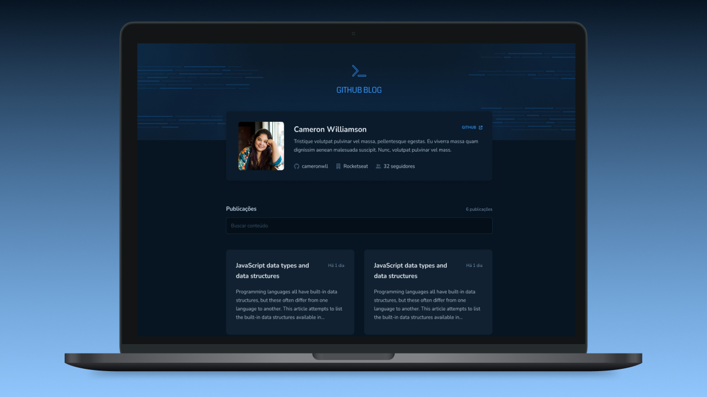

  

  <a href="#-tecnologias">Tecnologias</a>&nbsp;&nbsp;&nbsp;|&nbsp;&nbsp;&nbsp;
  <a href="#-projeto">Projeto</a>&nbsp;&nbsp;&nbsp;|&nbsp;&nbsp;&nbsp;
  <a href="#memo-licença">Licença</a>

 
  
  

  

## 🚀 Tecnologias

- Next.js
- Sass

## 🚧 Projeto

Live Preview: https://github-blog-fawn.vercel.app/

Figma: https://www.figma.com/file/qvpkgNLDB0zcUO7Q96PQgg/GitHub-Blog-(Community)

## :memo: Licença

Esse projeto está sob a licença MIT. Veja o arquivo [LICENSE](LICENSE) para mais detalhes.
